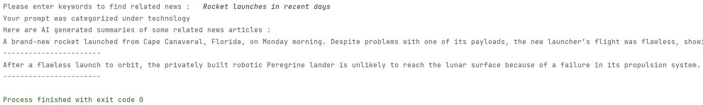

# Retrieval-Augmented-Generation-for-news

A RAG (Retrival Augmented Generation) based fully open source software which provides summaries of related news
articles built using ChromaDB vector database, mixtral-8x7b-instruct-v0.1 LLM and New York Times web scraper (ethical reasons :).

## Working
After the user 

## System Architecture
Data Collection : 
